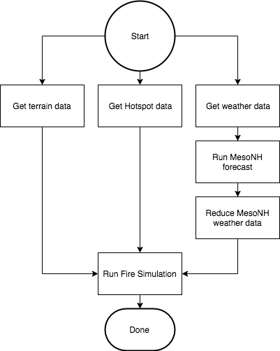

# Workflow Manager documentation

## Files
* `workflow.py` -  Contains the machinery of the workflow. Should be imported by anything that wants to use the workflow functionality
* `lock.py` - Contains code around making specific handlers atomic. This is automatically imported by workflow.py
* `persist.py` - Contains code for handlers to persist data. This is automatically imported by workflow.py
* `manager.py` - This is a process that executes the workflow
* `fire.py` - Contains example handlers for the forest fire workflow
* `MesoNH.py` - Contains example handlers for MesoNH workflows
* `example.py` - Sets off an example forest fire workflow
* `graph.py` - Given an IncidentID, this will create an image visualising the workflow graph
* `simulation.py` - Contains functions for recording simulations run on HPC machines to the database. If run directly, periodically checks the statuses of running simulations on the HPC machine, and if completed, will send a message to the workflow notifying it of the finished simulation


## Requirements
* The python module `pika` is required. It can be installed with `pip`
* A RabbitMQ server must be installed. One can be started with docker using '`docker run -p 5672:5672 rabbitmq`'


## How it works
The workflow manager works via RabbitMQ. Every node of the workflow is represented by a AMQP queue whose entries are consumed by a 'handler' callback function. When a message is put into a node's queue, the handler function is called, inspects the message, then carries out some task appropriate for the message. The handler may then (based on the information it has processed) decide to send messages to one or more (or no) queues to trigger other nodes of the workflow. As such we can have a complicated workflow with conditional branching, parallel execution of nodes (assuming we have multiple worker processes) and loops if necessary. This is a push-based approach, where the workflow reacts to messages being pushed into it. 

## Writing handlers and constructing your workflow
Handler functions (which take the message as their input) are decorated with `@workflow.handler` and registered with RabbitMQ using `workflow.RegisterHandler(handler,queue)`. 

Messages are enqueued to be sent with `workflow.send(queue,message)`. The messages _must_ be sent as python dictionaries as these are converted to json when sent through RabbitMQ. The message _must_ contain a key `IncidentID` which is the UUID of the incident. This is to identify which incident the message belongs to so it may be approproately processed. Not including this key will throw and error when invoking `workflow.send`. As a handler exits, the enqueued messages are automatially sent. If sending a message from outside a handler (e.g. to start a workflow) use `workflow.FlushMessages()` to send the message(s).

Handlers are by default stateless, as the only information they have is that contained in the message that triggered them. Sometimes we need a handler to be able to persist some data so it can appropriately handle a new message based on something it has done previously. To this end the `workflow.Persist.Put(IncidentID,dict)` and `workflow.Persist.Get(IncidentID)` functions can be used. The first puts user-specified data in the form of a python dictionary into a database, labelled with the `IncidentID` and the name of the handler. The `Get` function returns the dictionarys from the previous calls to `Put` from that handler for the current incident. _This data is stored in json format, so any perisisted data must be jsonifyable._

To run a workflow, an incident (a specific incidence of a workflow) must first be declared, using the `workflow.CreateIncident(name,kind,incident_date)` function, where `name` is a name for the incident, `kind` is the kind of incident, and `incident_date` is the date the incident started at (defaults to `datetime.datetime.now()`). If an incident isn't declared (or an invalid IncidentID is passed to `workflow.send`) then an error will be thrown.

When a incident is finished, `workflow.Complete(IncidentID)` can be called to signal to the workflow engine that this workflow is finished. This sends a message to a special internal cleanup handler that marks the workflow as completed and removes temporary logs etc. There is a similar `workflow.Cancel(IncidentID)` function that is similar to complete but logs the workflow as cancelled. _*If you call these from outside of a handler you will need to call `workflow.FlushMessages` to ensure the cleanup message is sent!*_

## Workflow execution
We need to have a process running that act a consumer for the messages. This is the process that collects messages from the RabbitMQ server and handles them, thereby executing the workflow. To register as a consumer, `workflow.execute()` is called. This puts the consumer into an infinite loop waiting for messages. `manager.py` is the default consumer.

### Parallel workflow execution
It is possible to run several consumer processes. The messages are distributed between the different consumers and so they can be processed concurrently. To do this, simply run multiple incidences of `manager.py`. In some cases we may wish to ensure that only a single incidence of a handler (for a given incident) is run at one time to prevent race conditions. To do this we can decorate the handler with the `atomic` decorator:

```python
@workflow.atomic
@workflow.handler
def atomic_handler(msg):
    ...
```
This checks to see if the handler can be run. If not, the message is re-queued to rabbitMQ and will be scheduled to be processed again.

<!-- Or if we only wish to protect a certain part of the handler's execution, we can use the `GetLock` and `ReleaseLock` functions within the function:

```python
    label = "some label for this lock so it can be identified"
    workflow.GetLock(label,IncidentID)
    #Some code that can only be executed by one consumer at a time
    workflow.ReleaseLock(label,IncidentID)
```

If one consumer is executing code inside this region, another consumer will wait until the lock has been released before executing its code. -->

## Example Workflow
Consider we have two nodes connected together called A and B, whose workflow is `Start -> A -> B -> End`. An example code to define and execute the workflow is:
```python
import workflow

#define the handlers for A and B
@workflow.handler
def A_handler(message):
    #do something with message
    print("Hello from A")
    #enqueue message to queue associated with B. 
    #This is automatically sent as this handler exits
    workflow.send(message=message,queue="B_queue")

@workflow.handler
def B_handler(message):
    #do something with message
    print("Hello from B")
    
    #Tell the workflow system that this incident is finished
    workflow.Complete(message["IncidentID"])
    
    

#register these handlers to the queues
workflow.RegisterHandler(handler=A_handler,queue="A_queue")
workflow.RegisterHandler(handler=B_handler,queue="B_queue")


if __name__ == "__main__":

    #create an incident
    IncidentID = workflow.CreateIncident(name="some name",kind="DUMMY_INCIDENT")
    
    #create a dictionary for the message and include the IncidentID
    message={ "IncidentID" : IncidentID}

    #enqueue message to A to start workflow
    workflow.send(queue="A_queue",message=message)

    #send the enqueued message
    workflow.FlushMessages()

    #execute the workflow (this starts up an infinite loop)
    workflow.execute()
```

## The Fire and MesoNH workflows
At present the workflow defined in `MesoNH.py` and `fire.py` (and executed in `example.py`) is very simplified and only represents a skeleton workflow. The handlers only pass on messages to the appropriate parts of the workflow, and do not process anything. The workflow is as shown below:



In order for the fire simulation to be run it requires three dependencies: terrain data, hotspot data and post-processed output data from MesoNH. In order to obtain the MesoNH output data, we must first collect data from a weather forecast, feed this into MesoNH, then reduce the MesoNH data. The handlers for each of these dependencies send messages to the fire simulation queue to say they have completed their tasks. Each time a message comes into the queue, the fire simulation handler is called and it checks to see if all three dependencies are met. If they are, it runs the simulation, else it does nothing and waits for another message.

If the `remote` argument is passed to `example.py` when it is run, this will request that a dummy fire simulation is run on ARCHER. In this case, the workflow submits the job to ARCHER. Running `simulation.py` will periodically poll ARCHER's queue and when the job is completed, will send a message to the workflow to handle the simulation's results.

## Running the example workflow
The example contained in `example.py` runs the fire workflow (see above). To run this we first need
* A running RabbitMQ server (e.g. use a rabbitmq docker container exposing port 5672)
* `manager.py` to be running (this is the "workflow engine" that listens for messages and executes the handlers)

If we then run `example.py [remote]` it will send messages to the terrain, hotspot and weather data handlers to kickstart the workflow. If we chose the `remote` option, we then want to start `simulation.py` to monitor the queue and alert the workflow manager to the finsihed job. The output from `manager.py` (after everything has finished) should be:
```
python manager.py 
 [*] Opening connection to RabbitMQ server
Database initialised

 [*] Workflow Manager ready to accept messages. To exit press CTRL+C 

In weather data handler
In Fire hotspot handler
In Fire terrain handler
In weather simulation handler
In fire simulation handler
   Hotspot data available
Will do nothing - waiting for data
In fire simulation handler
   Hotspot data available
   Terrain data available
Will do nothing - waiting for data
In weather results handler
In fire simulation handler
   Hotspot data available
   Terrain data available
   Weather data available
Will execute fire simulation remotely
Connecting to login.archer.ac.uk
Submitted remote job 6901077.sdb
Remote simulation results available!
Connecting to login.archer.ac.uk
Simulation results are:
--------------------------------------------------------------------------------
lots of fire - simulated remotely!
--------------------------------------------------------------------------------


```