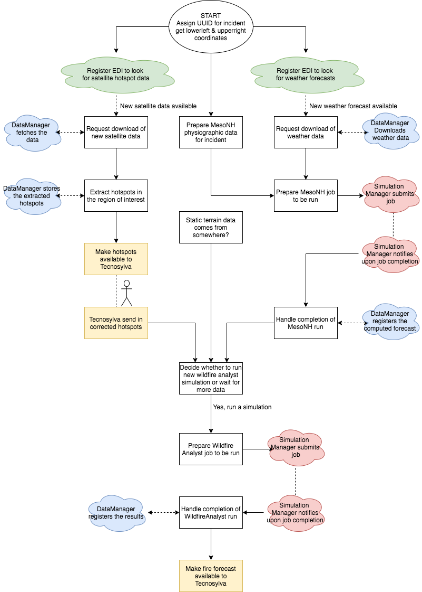

# Wildfire workflow

This directory contains the code for the wildfire workflow. It is started with the `wildfire_init` handler in `main.py`.

The workflow at present is shown below:

The proposed workflow is:

